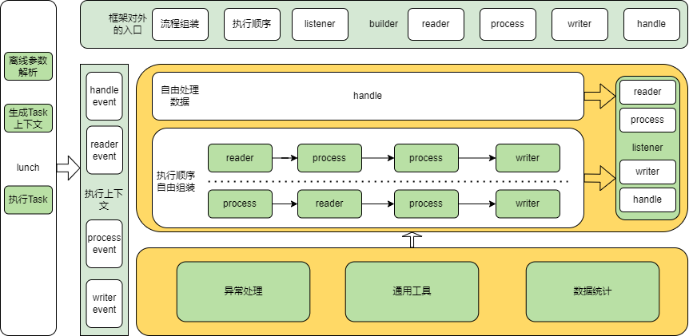

# 应用简介

版本规划：

* Task框架更关注Task本身的编排，Task维度的编排调度，更多是调度系统需要考虑的功能
* 通用执行Task，包括process 和 handle两种模式 
* v0.0.1版本：reader-convertor-calculator...-convertor-writer 
* 单数据源读取，转换，多个计算，转换，单次写入 
* v0.0.2版本：reader-process...-writer 
* 单数据源读取，多个处理，单次写入 
*
* v1.0.1版本：reader...-preProcess-process...-writer 
* 多数据源读取，前序处理，多个处理，单次写入 
* v1.0.2版本：移除preTask
*
* v1.1.0版本：
* 1.Deprecated preProcess和Evaluator
* 框架统一概念只有step（reader、process、writer）
* 具体process的功能（例如preProcess和Evaluator）由使用者自定义
* 2.增加process执行器（FreeProcessTaskExecutor）：
* step的顺序可由使用者自定义，不特指定为reader-process-writer
*
* v2.0.0版本：process流程编排：并行，串行，先后等
* 技术抽象：
* 1.产品概念的reader，process，preProcess，writer抽象为统一基础process处理器
* 2.根据基层process处理器，上层实现reader、process、writer等
* 3.增加分支流程控制：基层process处理的并行，串行，前后等

功能描述： Task的组成由Builder构造出的Task和TaskCommandParameters组成一个完整Task，
框架内部默认runner，会解析命令行输入参数组装Task和TaskCommandParameters，并运行Task

架构图：

