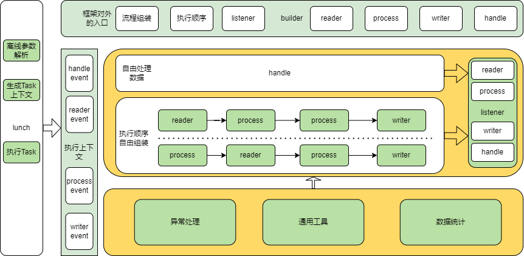

# Kafeihu Task Framework

[](LICENSE)
[]()

> **A lightweight and agile Java batch processing & task orchestration framework, inspired by Spring Batch.** 
> （一个轻量级的 Java 批处理与任务编排框架）

## 📖 English Introduction

**Kafeihu Task** is a lightweight Java execution framework focusing specifically on the **internal orchestration of tasks**. 

Unlike traditional, heavy-weight scheduling systems, this framework strictly decouples the "task execution engine" from the "macro-scheduling system". It delegates macro-level timing and triggering (like Cron jobs) to specialized scheduling platforms, while it concentrates purely on providing a highly flexible, low-coupling engine for underlying data flow processing and process orchestration (supporting both `Process` and `Handle` execution modes).

### Key Features:
- **Separation of Concerns**: Focuses solely on inner-task workflows (e.g., data reading, transformation, processing, and writing) without being bound to any specific cron scheduler.
- **Everything is a Step**: Breaks the rigid `Reader-Process-Writer` mold. It abstracts all phases into a unified foundational `Step`, allowing developers to define completely custom execution topologies.
- **Minimalist Assembly**: Leverages the `Builder` pattern to construct tasks effortlessly. Combined with `TaskCommandParameters`, it easily resolves command-line or API inputs to trigger task execution.

---

## 🌟 中文介绍与核心理念

Kafeihu Task 是一个专注于**任务（Task）本身内部编排**的轻量级执行框架。在数据密集型应用普及的今天，本框架为开发者提供了比传统重量级框架更敏捷的选择。

- **职责分离**：专注于单个 Task 内部流程的编排，宏观的定时调度交由外部专业的调度系统负责。
- **万物皆 Step**：打破固化的 `Reader-Process-Writer` 模型，将所有环节抽象为统一的基础处理器（Step），允许完全自定义执行流。
- **极简组装**：通过 `Builder` 模式灵活构建任务，结合 `TaskCommandParameters` 轻松实现基于命令行或 API 的参数解析与任务运行。

## 📊 架构图 (Architecture)

*(框架的核心设计思想与组件交互关系)*



## 🚀 核心组件与功能描述

一个完整的执行单元由两部分组成：
1. **Task**：通过 `Builder` 模式动态构造的任务执行拓扑图。
2. **TaskCommandParameters**：任务运行时的上下文与外部参数。

框架内置了默认的 `Runner`，支持自动解析命令行输入参数，将其与对应的 Task 绑定并触发执行，极大降低了批处理脚本的开发门槛。

## 🗺️ 版本规划与演进路线 (Roadmap)

我们正致力于将框架从“线性流处理”全面演进为“复杂的流程编排引擎”。

### 🌱 Phase 1: 经典线性处理时代 (v0.0.1 - v1.0.x)
- **v0.0.1**：基础数据流模型。支持单数据源读取、数据转换、多重计算、二次转换及单次写入（`reader -> convertor -> calculator... -> convertor -> writer`）。
- **v0.0.2**：流程精简。优化为更紧凑的单源读、多重处理、单次写入模型（`reader -> process... -> writer`）。
- **v1.0.1**：支持多数据源读取与前置处理（`reader... -> preProcess -> process... -> writer`）。
- **v1.0.2**：精简底层逻辑，移除冗余的 `preTask` 概念。

### 🌿 Phase 2: 概念统一与自由编排 (v1.1.0)
- **概念大一统**：废弃特化的 `preProcess` 和 `Evaluator`。框架核心概念统一收口为 **Step**（包括 `reader`、`process`、`writer`）。具体的业务逻辑全部交由开发者自定义扩展。
- **自由执行器 (FreeProcessTaskExecutor)**：打破了固定的执行顺序限制。步骤组合不再局限于 `reader-process-writer`，使用者可根据业务随意组装 Step。

### 🌳 Phase 3: 复杂拓扑与并发调度 (v2.0.0 - 进行中)
- **高级流程编排**：全面支持 Task 内部流程的 **并行（Parallel）**、**串行（Sequential）** 及 **前后置依赖** 控制。
- **底层技术抽象**：
  1. 将产品概念层面的 `reader`、`process`、`writer` 向下抽象为统一的 `Base Process Handler`（基础处理器）。
  2. 提供开箱即用的高层级接口（Reader/Writer 等），均基于底层基础处理器实现。
  3. 引入**分支流程控制引擎**，支持复杂的 DAG（有向无环图）式任务执行。

## 💻 快速开始 (Quick Start)

```java
// 1. 构建参数上下文
TaskCommandParameters params = new TaskCommandParameters(args);

// 2. 通过 Builder 自由编排 Task (支持完全自定义的 Step 顺序)
Task myTask = TaskBuilder.newBuilder()
        .addReader(new MyDataReader())
        .addProcess(new MyDataProcessor())
        .addWriter(new MyDataWriter())
        .build();
        
// 3. 使用框架默认 Runner 执行
DefaultTaskRunner runner = new DefaultTaskRunner();
runner.run(myTask, params);
